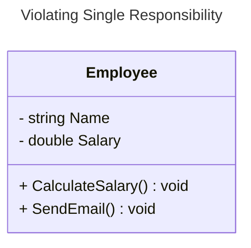
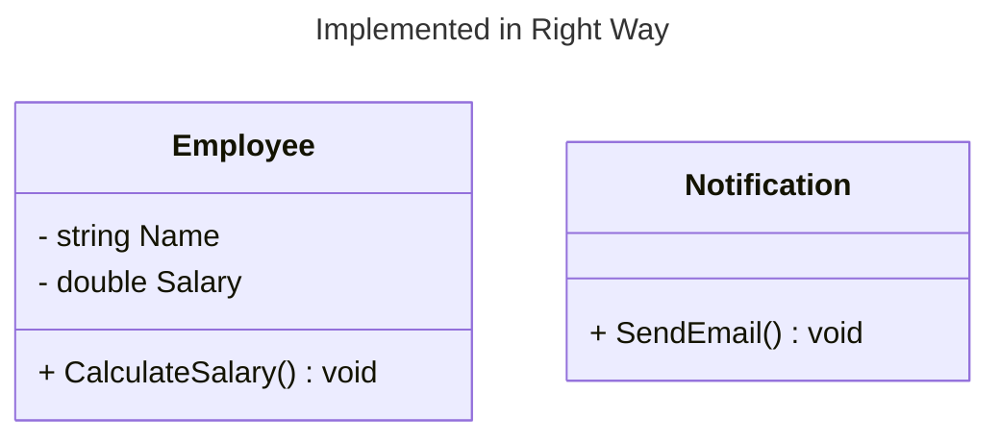
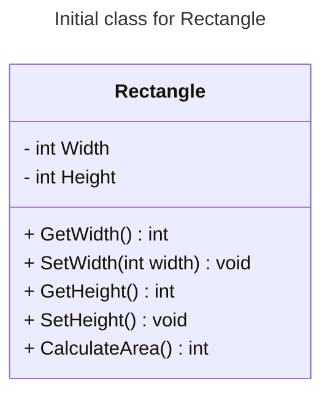
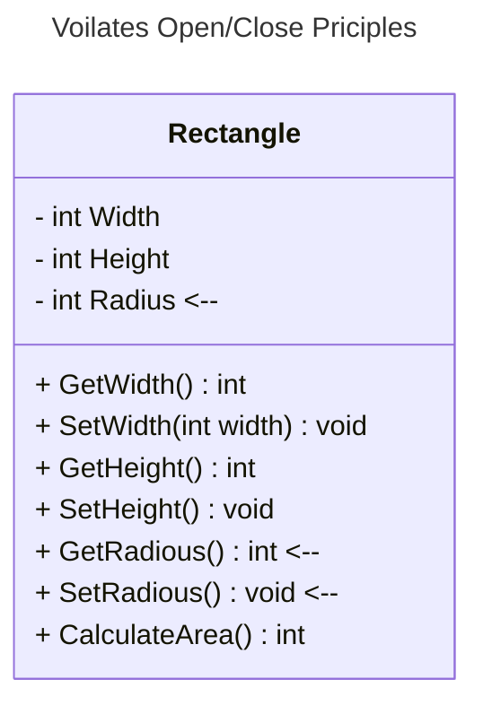
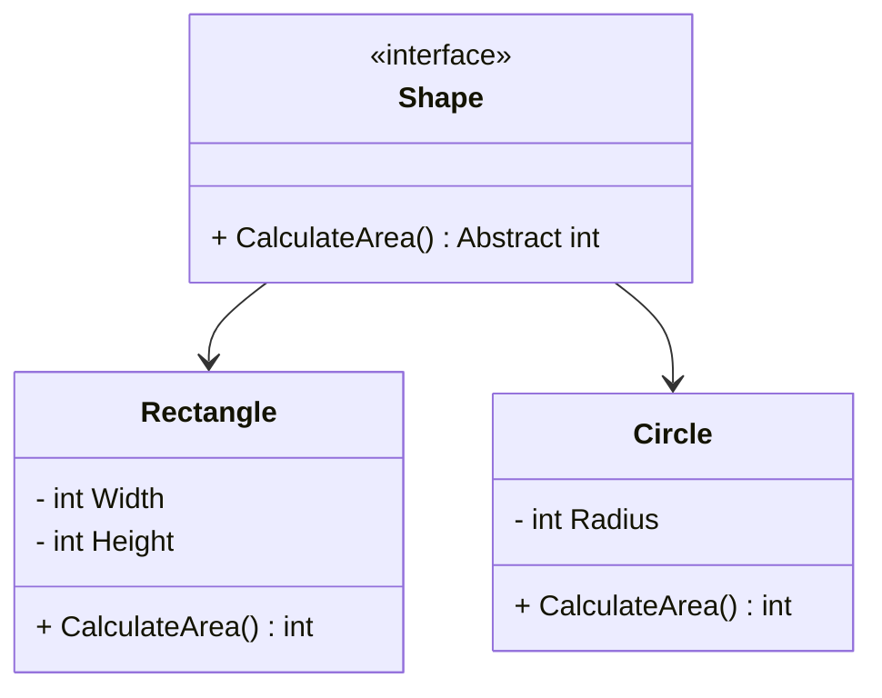
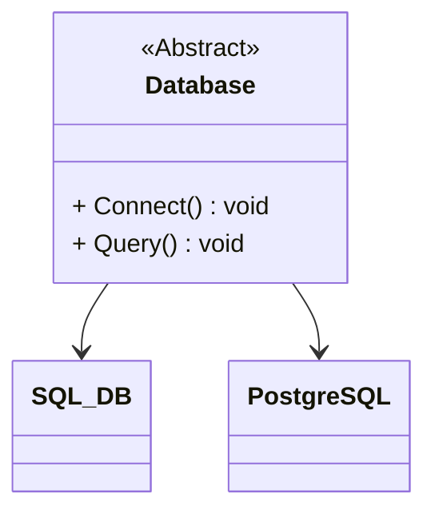

# Solid Principles

SOLID principle is quite famous in OOP. There are 5 components to it.

## S → Single Responsibility

**A class should have a single responsibility.** If a Class has many responsibilities, it increases the possibility of bugs because making changes to one of its responsibilities, could affect the other ones without you knowing.

This principle aims to separate behaviors so that if bugs arise as a result of your change, it won’t affect other unrelated behaviors.





## O → Open/Close Principles

**Classes should be open for extension, but closed for modification.** Changing the current behavior of a Class will affect all the systems using that Class.

This principle aims to extend a Class’s behavior without changing the existing behavior of that Class. This is to avoid causing bugs wherever the Class is being used.



Now, if we want to calculate the area of a circle, we should not update the class like this:



Instead we should write the class in such a way that it can be extendable:



## **L →** **Liskov Substitution**

This principle states that objects of a superclass should be replaceable with objects of its subclasses without affecting the correctness of the program. That means a subclass should completely adhere to the behavior expected by the superclass. The Liskov Substitution Principle encourages a design where subclasses are substitutable for their base classes.

When a **child** Class cannot perform the same actions as its **parent** Class, this can cause bugs.

The **child** Class should be able to process the same requests and deliver the same result as the **parent** Class or it could deliver a result that is of the same type.

### Violating LSP

```csharp
using System;
namespace test
{
    class Program
    {
        static void Main(string[] args)
        {
            Apple apple = new Orange(); // It will show orange and will violate LSP
            Console.WriteLine(apple.GetColor());
        }
    }
    public class Apple
    {
        public virtual string GetColor()
        {
            return "Red";
        }
    }
    public class Orange : Apple
    {
        public override string GetColor()
        {
            return "Orange";
        }
    }
}

```

### Right way to implement

```csharp
using System;
namespace Liskov_Substitution
{
    class Program
    {
        static void Main(string[] args)
        {
            IFruit fruit = new Orange();
            Console.WriteLine($"Color of Orange: {fruit.GetColor()}");
            fruit = new Apple();
            Console.WriteLine($"Color of Apple: {fruit.GetColor()}");
            Console.ReadKey();
        }
    }
    public interface IFruit
    {
        string GetColor();
    }
    public class Apple : IFruit
    {
        public string GetColor()
        {
            return "Red";
        }
    }
    public class Orange : IFruit
    {
        public string GetColor()
        {
            return "Orange";
        }
    }
}
```

### Real life example

```csharp
using System;
namespace Liskov_Substitution
{
    //Imagine you have a base class BankAccount
    public class BankAccount
    {
        public string AccountNumber { get; set; }
        public decimal Balance { get; set; }

        public BankAccount(string accountNumber, decimal balance)
        {
            AccountNumber = accountNumber;
            Balance = balance;
        }

        public virtual void Deposit(decimal amount)
        {
            Balance += amount;
            Console.WriteLine($"Deposit: {amount}, Total Amount: {Balance}");
        }

        public virtual void Withdraw(decimal amount)
        {
            if (amount <= Balance)
            {
                Balance -= amount;
            }
            else
            {
                Console.WriteLine("Insufficient balance.");
            }
        }
    }

    //We have two derived classes: SavingsAccount and CurrentAccount
    public class SavingsAccount : BankAccount
    {
        public decimal InterestRate { get; set; }

        public SavingsAccount(string accountNumber, decimal balance, decimal interestRate)
            : base(accountNumber, balance)
        {
            InterestRate = interestRate;
        }

        public override void Withdraw(decimal amount)
        {
            if (amount <= Balance)
            {
                Balance -= amount;
                Console.WriteLine($"AccountNumber: {AccountNumber}, Withdraw: {amount}, Balance: {Balance}");
            }
            else
            {
                Console.WriteLine($"AccountNumber: {AccountNumber}, Withdraw: {amount}, Insufficient Funds, Available Funds: {Balance}");
            }
        }
    }

    public class CurrentAccount : BankAccount
    {
        public decimal OverdraftLimit { get; set; }

        public CurrentAccount(string accountNumber, decimal balance, decimal overdraftLimit)
            : base(accountNumber, balance)
        {
            OverdraftLimit = overdraftLimit;
        }

        public override void Withdraw(decimal amount)
        {
            if (amount <= Balance + OverdraftLimit)
            {
                Balance -= amount;
                Console.WriteLine($"AccountNumber: {AccountNumber}, Withdraw: {amount}, Balance: {Balance}");
            }
            else
            {
                Console.WriteLine($"AccountNumber: {AccountNumber}, Exceeded Overdraft Limit.");
            }
        }
    }

    //Testing the Liskov Substitution Principle
    public class Program
    {
        public static void Main()
        {
            BankAccount savingsAccount = new SavingsAccount("SA123", 1000m, 0.03m);
            BankAccount currentAccount = new CurrentAccount("CA456", 1500m, 500m);

            Console.WriteLine("Before Transactions:");
            PrintAccountDetails(savingsAccount);
            PrintAccountDetails(currentAccount);

            savingsAccount.Withdraw(500m);
            currentAccount.Withdraw(2000m);

            Console.WriteLine("\nAfter Transactions:");
            PrintAccountDetails(savingsAccount);
            PrintAccountDetails(currentAccount);

            Console.ReadKey();
        }

        static void PrintAccountDetails(BankAccount account)
        {
            Console.WriteLine($"Account Number: {account.AccountNumber}, Balance: {account.Balance}");
        }
    }
}
```

Ref: https://dotnettutorials.net/lesson/liskov-substitution-principle/

## **I →**  **Interface Segregation**

This Principle states that **Class should not be forced to implement any methods they don’t use. Rather than one fat interface, numerous little interfaces are preferred based on groups of methods, with each interface serving one submodule.**

```csharp
// Voilationg Interface Segregation Principles

using System;
namespace Interface_Segregation
{
    public class Book
    {
        public string Title { get; set; }
        public string Author { get; set; }
        public string ISBN { get; set; }
    }

    public interface IUser
    {
        void BorrowBook(string bookId);
        void ReturnBook(string bookId);
        void SearchCatalog(string searchTerm);
        void AddBook(Book book);
        void RemoveBook(string bookId);
    }

    public class Guest : IUser
    {
        public void BorrowBook(string bookId)
        {
            throw new NotImplementedException("Guests cannot borrow books.");
        }

        public void ReturnBook(string bookId)
        {
            throw new NotImplementedException("Guests cannot return books.");
        }

        public void SearchCatalog(string searchTerm)
        {
            // Implementation to search books.
        }

        public void AddBook(Book book)
        {
            throw new NotImplementedException("Guests cannot add books.");
        }

        public void RemoveBook(string bookId)
        {
            throw new NotImplementedException("Guests cannot remove books.");
        }
    }
}
```

```csharp
// Following Interface Segregation Principles
using System;
namespace Interface_Segregation
{
    public class Book
    {
        public string BookId { get; set; }
        public string Title { get; set; }
        public string Author { get; set; }
        public string ISBN { get; set; }

        public override string ToString()
        {
            return $"[BookId: {BookId}, Title: {Title}, Author:{Author}, ISBN:{ISBN}]";
        }
    }

    public interface IBorrowReturn
    {
        void BorrowBook(string bookId);
        void ReturnBook(string bookId);
    }

    public interface ISearchable
    {
        void SearchCatalog(string searchTerm);
    }

    public interface IManageInventory
    {
        void AddBook(Book book);
        void RemoveBook(string bookId);
    }

    public class Member : IBorrowReturn, ISearchable
    {
        public void BorrowBook(string bookId)
        {
            // Implementation to borrow a book.
            Console.WriteLine($"Member Borrow Book, BookId: {bookId}");
        }

        public void ReturnBook(string bookId)
        {
            // Implementation to return a book.
            Console.WriteLine($"Member Return Book, BookId: {bookId}");
        }

        public void SearchCatalog(string searchTerm)
        {
            // Implementation to search books.
            Console.WriteLine($"Member Search Book, Search Catalog: {searchTerm}");
        }
    }

    public class Librarian : IBorrowReturn, ISearchable, IManageInventory
    {
        public void BorrowBook(string bookId)
        {
            // Implementation to borrow a book.
            Console.WriteLine($"Librarian Borrow Book, BookId: {bookId}");
        }

        public void ReturnBook(string bookId)
        {
            // Implementation to return a book.
            Console.WriteLine($"Librarian Return Book, BookId: {bookId}");
        }

        public void SearchCatalog(string searchTerm)
        {
            // Implementation to search books.
            Console.WriteLine($"Librarian Search Book, Search Catalog: {searchTerm}");
        }

        public void AddBook(Book book)
        {
            // Implementation to add a book.
            Console.WriteLine($"Librarian Add Book, {book}");
        }

        public void RemoveBook(string bookId)
        {
            // Implementation to remove a book.
            Console.WriteLine($"Librarian Remove Book, BookId: {bookId}");
        }
    }

    public class Guest : ISearchable
    {
        public void SearchCatalog(string searchTerm)
        {
            // Implementation to search books.
            Console.WriteLine($"Guest Search Book, Search Catalog: {searchTerm}");
        }
    }
    
    //Testing the Interface Segregation Principle
    public class Program
    {
        public static void Main()
        {
            Console.WriteLine("Librarian:");
            Librarian librarian = new Librarian();
            Book book = new Book()
            {
                BookId = "BK-10001",
                Title = "SOLID Principle using C#",
                Author = "Pranaya Rout",
                ISBN = "ISBN-Demo"
            };
            librarian.AddBook(book);
            librarian.BorrowBook(book.BookId);
            librarian.SearchCatalog("SOLID");
            librarian.ReturnBook(book.BookId);
            librarian.RemoveBook(book.BookId);

            Console.WriteLine("\nMember:");
            Member member = new Member();
            //member.AddBook(book); //Compile Time Error
            member.BorrowBook(book.BookId);
            member.SearchCatalog("SOLID");
            member.ReturnBook(book.BookId);
            //member.RemoveBook(book.BookId); //Compile Time Error

            Console.WriteLine("\nMember:");
            Guest guest = new Guest();
            //guest.AddBook(book); //Compile Time Error
            //guest.BorrowBook(book.BookId); //Compile Time Error
            guest.SearchCatalog("SOLID");
            //guest.ReturnBook(book.BookId); //Compile Time Error
            //guest.RemoveBook(book.BookId); //Compile Time Error

            Console.ReadKey();
        }
    }
}
```

Ref: https://dotnettutorials.net/lesson/interface-segregation-principle/

## **D  →** **Dependency Inversion**

Use abstractions to decouple dependencies in the system. High level module should not depend on low level module, rather they should depend on the abstraction. 


